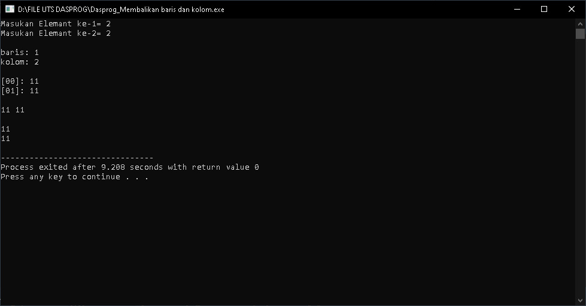

# Ujian Akhir Semester 
<br>Mata Kuliah&ensp;&ensp; : Dasar Pemrograman
<br>Nama&ensp;&ensp;&ensp;&ensp;&ensp;&ensp;&ensp;&nbsp;: MUHAMAD NOPID ANDRIANSYAH
<br>NIM&emsp;&emsp;&emsp;&emsp;&nbsp; : 1227050091
<br>Jurusan&emsp;&emsp;&emsp;: [Teknik Informatika](http://if.uinsgd.ac.id/) [UIN Sunan Gunung Djati Bandung](https://uinsgd.ac.id/)d.ac.id/) [UIN Sunan Gunung Djati Bandung](https://uinsgd.ac.id/) 

## Deskripsi Umum
``
Pada ujian akhir semester di berikan soal di mana kita di minta mengimput banyak kolom, baris dan banyak data, lalu menukar kolom menjadi baris dan baris manjadi kolom. Cara kerjanya adalah dengan membuat beberapa variable untuk memasukan  banyaknya data pada array dan membuat variable untuk menentukan  jumlah kolom dan barisnya.

Selajutnya akan mengunakan for looping untuk memasuaka nilai data dan outut nilai data, for juga di gunakan untuk menyimpan variable transpose pada variable arr yang nanatinya akan melakukan program tukar baris dan kolom. Kemudian jika program di run atau dijalankan akan  menampilkan output berupa program nilai yang telah di ditukar baris dan kolomnya.
``
## Source Code
```
#include <iostream>
using namespace std;

int main()
{
 int e1,e2;
 cout << "Masukan Elemant ke-1= ";
 cin >> e1;
 cout << "Masukan Elemant ke-2= ";
 cin >> e2;
	
 cout << "\n";
 int arr[e1][e2], transpose[e1][e2], baris, kolom;
 
 cout << "baris: "; cin >> baris;
 cout << "kolom: "; cin >> kolom;
 
 cout << "\n";
 for(int i=0; i<baris; i++){
  for(int j=0; j<kolom; j++){
   cout << "["<<i<<j<<"]: ";
   	cin >> arr[i][j];
  }
 }
 
 cout << "\n";
 
 for(int i=0; i<baris; i++){
  for(int j=0; j<kolom; j++){
   cout << arr[i][j] << " ";
   if(j == kolom - 1);
  }
  cout << "\n";
 }
 
 cout << "\n";
 
 for(int i=0; i<baris; i++){
  for(int j=0; j<kolom; j++){
   transpose[j][i] = arr[i][j];
  }
 }
 
 for(int i=0; i<kolom; i++){
  for(int j=0; j<baris; j++){
   cout << transpose[i][j] << " ";
   if(j == baris - 1);
  }
  cout << "\n";
 }
  return 0;
}
```
## Output


